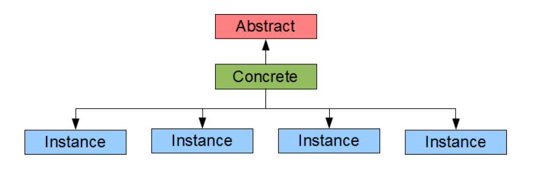
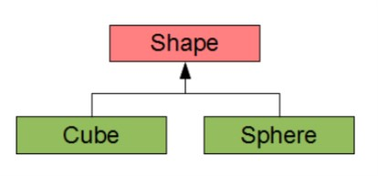

# Inheritance and Inclusion Polymorphism

Inheritance is a relationship between user-defined types (classes, structs, etc). These types are:
- Concrete - Their representation is part of the their definition and is known
- Abstract - Their representation is not part of their definition and is unknown

Concrete classes can be instantiated because it provides (or inherits) the implementation for all of its methods.
Abstract classes cannot be instantiated because at least one method has not been implemented.



An example of an abstract base class (Shape). Shape has volume

```cpp
#ifndef SHAPE_H   // PRE-PROCESSOR GUARDS START
#define SHAPE_H   (These guards implement the one-definition rule)
// A Shape
// Shape.h

virtual double volume() const = 0;

#endif            // PRE-PROCESSOR GUARDS END
```

A Shape object has a volume (a geometric property). We identify this to a class by deriving a conrete class from the abstract.


Each of the concrete classes (Cube and Sphere) can define their own volume() method

```h
// A Cube
// Cube.h

#include "Shape.h"

class Cube : public Shape
{
  double length;
public:
  Cube(double);
  double volume() const;
};
```

```cpp
// A Cube
// Cube.cpp

#include "Cube.h"

Cube::Cube(double l)
  : length {l}
{
}

double Cube::volume() const
{
  return length * length * length;
}
```

```h
// A Sphere
// Sphere.h

#include "Shape.h"

class Sphere : public Shape 
{
  double radius;
public:
  Sphere(double);
  double volume() const;
}
```

```cpp
// A Sphere
// Sphere.cpp

#include "Sphere.h"

Sphere::Sphere(double r)
  : radius {r}
{
}

double Sphere::volume() const
{
  return 4.18879 * rad * rad * rad;
}
```

```cpp
// Shape Hierarchy
// Shape.cpp

#include <iostream>
#include "Cube.h"
#include "Sphere.h"

void displayVolume(const Shape* shape) {
  if (shape)
      std::cout << shape->volume() << std::endl; 
  else
      std::cout << "error" << std::endl;
}

Shape* select() {
  Shape* shape;
  double x;
  char c;
  std::cout << "s (sphere), c (cube) : ";
  std::cin >> c;
  if (c == 's') {
      std::cout << "dimension : ";
      std::cin >> x;
      shape = new Sphere(x);
  } else if (c == 'c') {
      std::cout << "dimension : ";
      std::cin >> x;
      shape = new Cube(x);
  } else
      shape = nullptr;
  return shape;
}

int main() {
  Shape* shape = select();
  displayVolume(shape);
  delete shape;
}
```

# Polymorphic Objects
- Objects that can have different types throughout its lifetime.
In our case, a shape is polymorphic because a Shape can be a sphere, a cube, etc.