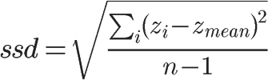
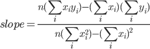

# STL Algorithms
In this workshop, you use the Standard Template Library’s algorithms to evaluate sample data.

## Learning Outcomes
Upon successful completion of this workshop, you will have demonstrated the abilities to
- copy data from a file into a sequential container
- accumulate data values using the STL’s numeric library
- specify an operation on each value in a data set using a lambda expression
- sort the data values in a data set using the STL’s algorithm

## Introduction to Statistical Analysis
Statistical analysis uses standard measures to make predictions based on a small sample of the actual data:
- sample mean — the average of all values in the sample
- sample standard deviation — the spread of the numbers away from their mean
- sample median — the middle number in the sorted set of the values (that is, the value separating the lower and upper halves of the data in a sorted set)

### Sample Mean
The formula for _sample mean_ is:


 

The symbol `Σ` denotes ‘sum of’, `i` refers to an element in the set, and `n` refers to the number of elements in the set.

### Simple Standard Deviation
The formula for _sample standard deviation_ (ssd) is:




### Regression Line
A regression line relates a set of independent (`x`) values to a corresponding set of dependent (`y`) values. The number of values in each set is the same — each value in the independent set has one corresponding value in the dependent set.

The regression line best fits the pairs of data values. It is the line that passes through the data points drawn on a two-dimensional `(x, y)` system of coordinates as close as possible to the data points. The line’s coefficients are:

- `slope` — the slope of the line in the x-y plane
- `y_intercept` — the `y` value of the line where it crosses the y-axis

The formulas for these two coefficients are:





Graphically, the linear regression of a set of points can be displayed like


where the dots represent the X-Y coordinates of the points in the dataset, and with the red line is shown the regression line calculated with the formulas above. The image is taken from Wikipedia; you can find more information about linear regression there.

## Specifications
Code a class template named `DataTable` for performing statistical analysis on data stored in text files. This lab is to be completed using STL Algorithm calls. **Failure to use STL algorithm functions will result in rejected workshop and/or loss of marks.** Mean, sigma, median, and regression functions should not contain any manual loops.

### `DataTable` class

Upon instantiation, a `DataTable` object receives a reference to the file stream that holds the data values, the field width for displaying the data and the number of decimals to display. The object retrieves the data values from the file and stores them in its instance variables.

Your design includes the following queries:

- `T mean() const` — returns the mean value of the dependent coordinate
- `T sigma() const` — returns the standard deviation of the dependent coordinates
- `T median() const` — returns the median value of the dependent coordinate
- `void regression(T& slope, T& y_intercept) const` — sets the parameters to the slope and intercept for the data set
- `void display(std::ostream&) const` — displays the data pairs as shown below
- `size_t getSize() const` — returns the number of points in the dataset (the number of pairs)

Your design also overloads the insertion operator as a helper for the `DataTable` class:
- `std::ostream& operator<<(std::ostream&, const DataTable&)` — calls the `DataTable::display(...)`

### File Records
Each record in the file consists of two fields: the independent (`x`) and the dependent (`y`) values. A sample file is presented below
```
2.1 8
2.5 12
4.0 14
3.6 10
```
The the attachments to this post for complete data files

## `main` Module
The tester provided analyzes data using your `DataTable` template. The program receives two command line arguments, representing the name of two files containing data to be analized.

Do not modify the `main` module.

```cpp
// Workshop 7 - STL Algorithms
// w7.cpp
// updated by cornel on 18.10.2018

#include <iostream>
#include <iomanip>
#include <string>
#include "DataTable.h"
#include "DataTable.h" // this is intentional

const int FW = 8; // field width
const int ND = 4; // precision for numbers

using namespace std;

void processFile(const char* pFileName)
{
    cout << endl;
    cout << "****************************************" << endl;
    cout << "*** Processing file [" << pFileName << "]" << endl;
    cout << "****************************************" << endl;

    std::ifstream dataFile(pFileName);
    if (!dataFile)
    {
        cerr << endl << "***Failed to open file " << pFileName << "***" << endl;
        return;
    }

    try
    {
        w7::DataTable<float> data(dataFile, FW, ND);

        if (data.getSize() < 10)
        {
            cout << endl;
            cout << "Data Values" << endl
                 << "------------" << endl;
            cout << data;
        }

        float m, c;
        data.regression(m, c);
        cout << endl << "Statistics"
             << endl << "----------";
        cout << fixed << setprecision(ND);
        cout << endl << " y mean = " << setw(FW) << data.mean()
             << endl << " y sigma = " << setw(FW) << data.sigma()
             << endl << " y median = " << setw(FW) << data.median()
             << endl << " slope = " << setw(FW) << m
             << endl << " intercept = " << setw(FW) << c
             << endl;
    }
    catch (std::string& msg)
    {
        cout << "ERROR: " << msg << endl;
    }
    cout << "************************************" << endl << endl;
}

int main(int argc, char** argv)
{
#ifndef W7_DATATABLE_H
    cout << "Bad header guard for DataTable.h! Follow the convention "
        << "when choosing a header guard as swhown at the lecture.\n";
#endif

    cout << "Command Line: " << argv[0];
    for (int i = 1; i < argc; i++)
        cout << " " << argv[i];
    cout << endl;

    if (argc != 3)
    {
        cerr << endl << "***Incorrect number of arguments***" << endl;
        return 1;
    }

    processFile(argv[1]);
    processFile(argv[2]);

    return 0;
}
```

### Sample Output
The output from your completed main program for the file contents listed above should read like:

```
Command Line: ws Simple.dat HS_College_GPA.dat

****************************************
*** Processing file [Simple.dat]
****************************************

Data Values
------------
       x       y
  2.1000  8.0000
  2.5000 12.0000
  4.0000 14.0000
  3.6000 10.0000

Statistics
----------
  y mean    =  11.0000
  y sigma   =   2.5820
  y median  =  12.0000
  slope     =   1.9087
  intercept =   5.1784
************************************

****************************************
*** Processing file [HS_College_GPA.dat]
****************************************

Statistics
----------
  y mean    =   3.1212
  y sigma   =   0.5066
  y median  =   3.2100
  slope     =   0.7802
  intercept =   0.7279
************************************
```